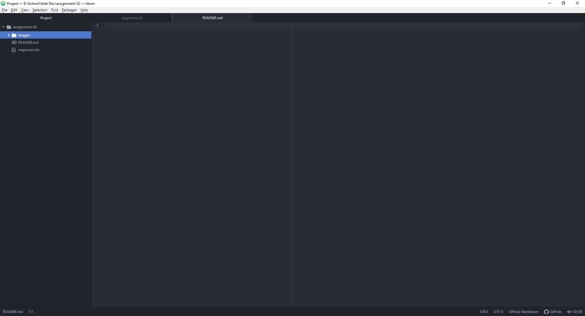

# Assignment 2

## Alexander Stewart

I worked in web development for about 3 years, but I was mostly self taught so I am hoping to get a better understanding of web development as a whole.

- I have learned about readme files and how to use markdown.
- I have learned how the internet works.
- I have learned how data travels on the internet.

[Twitch.tv](https://www.twitch.tv/)

[Responses](./responses.txt)

