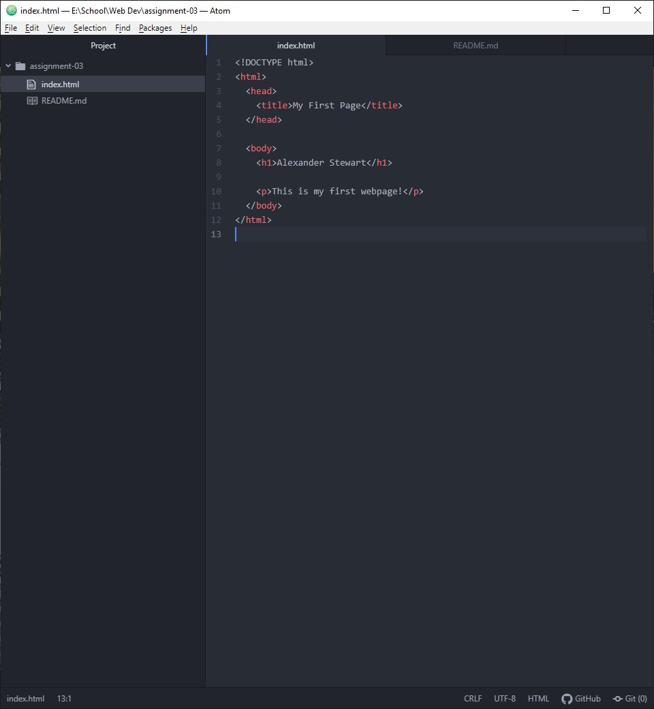

# Assignment 3

## Alexander Stewart

### How Browsers Function

Your computer sends a request over the network to a server, which sends back a collection of web content. Your browser then interprets the content and displays the page. The browser uses multiple things to interpret the content:

- A Rendering Engine, which takes in CSS and HTML files and displays the page.
- A Browser Engine, which directs actions between the UI and rendering engine as well as external communication with servers.
- A JavaScript Interpreter
- Data storage

I frequently use Google Chrome to surf the web and develop websites.

### What is a Markup Language

A Markup Language helps dictate the architecture of a page, with a focus on its text content. A common markup language used in development is HTML, which functions as the foundation and structure of a page's content.

### Screenshot

