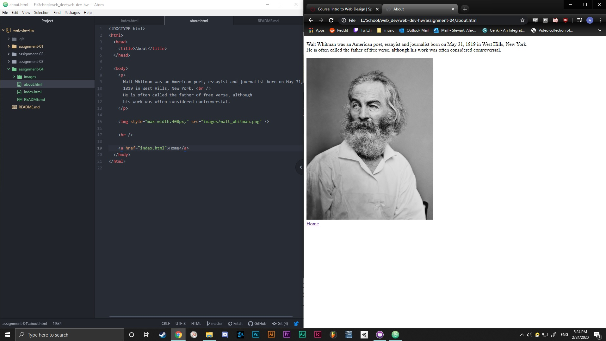

# Assignment 4

## Alexander Stewart

### The Wayback Machine

I used The Wayback Machine to look at YouTube back in 2005. Everything was much smaller, there were a lot less images and a lot more text compared to YouTube today.

### GIT Module

I have used the GIT Module before in previous work and other classes so I did
not learn much more than I already knew. However, it is still a very useful program and a nice refresher.

### Screenshot

