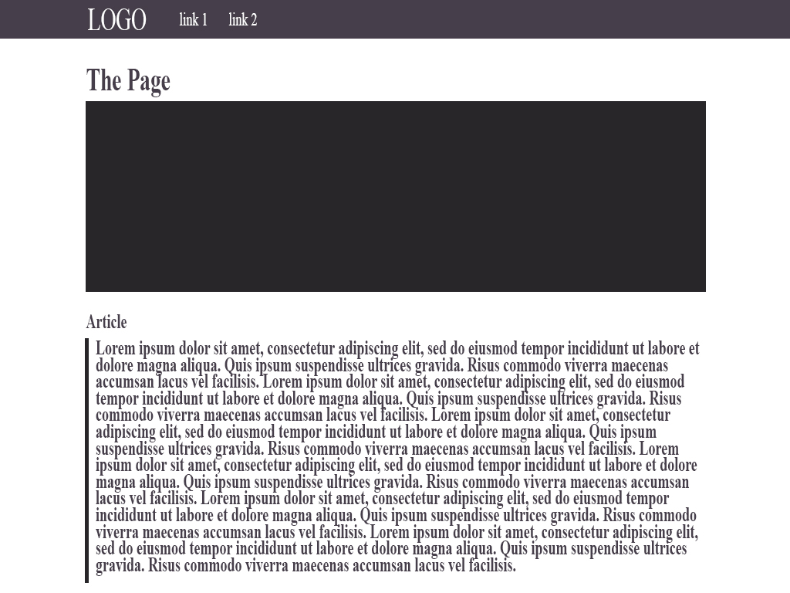

# Assignment 11

## Alexander Stewart

### Padding, Margins and Borders

- Padding is the amount of space between the inner content of the element, and the border of the element
- The margin is the space between the element and other elements/the edge of the parent element
- The border is the edge of the element.

### Sketch

### Work Cycle

For this assignment I learned about how to space content properly throughout my website by using sizing methods, margins, padding and borders. I tried to create a page that resembles a news article.
